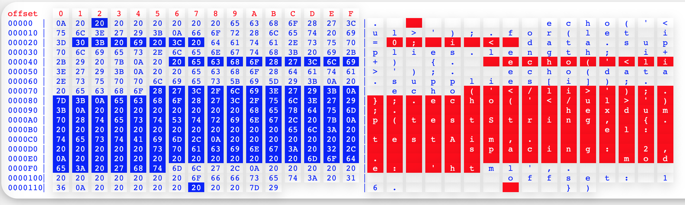

# Hexdump.js
一个前端二进制查看器
目前提供原生 JS 组件，之后将会提供 Vue 和 React 的组件


## 特性
支持高亮选中的二进制查看器，支持单选与批量选中，目前仅 HTML 模式支持

## 使用方法
```
// 引入hexdump.js
<script src='./hexdump.js'></script>
```

```
API
let options = {
    el: testAim, // 渲染元素
    spacing: 2,  // 间距
    mode: 'string', // 渲染模式，提供html和string两种模式，html模式具有更多的交互性和更好的外观，string模式必须置于pre元素中
    offset: 8,  // 偏移，默认16
    render: true, // 是否渲染，若为false，则可以从返回值中拿到结果
    rightBreak: '|',  // 左侧分隔符
    leftBreak: '|' // 右侧分隔符
}
hexdump("string", options);
```